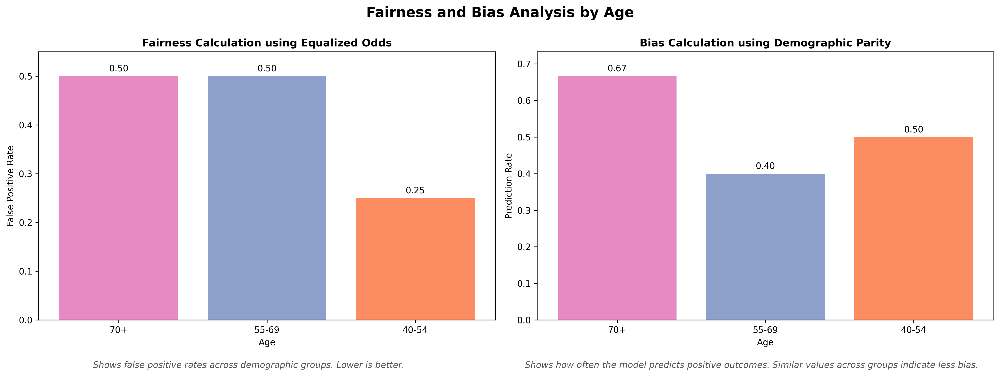
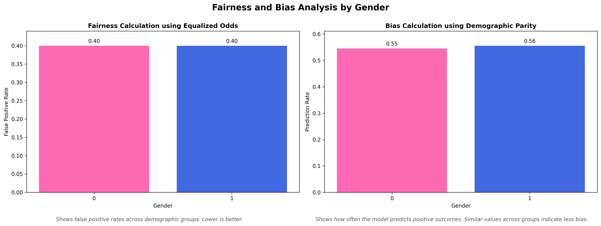
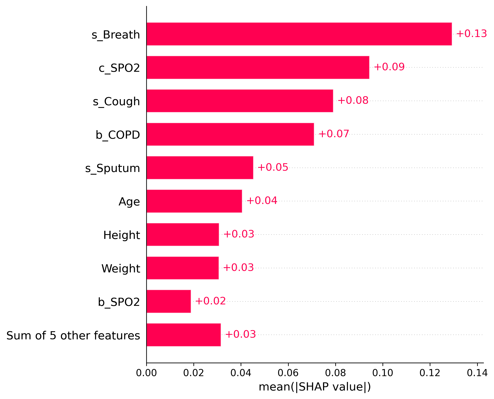
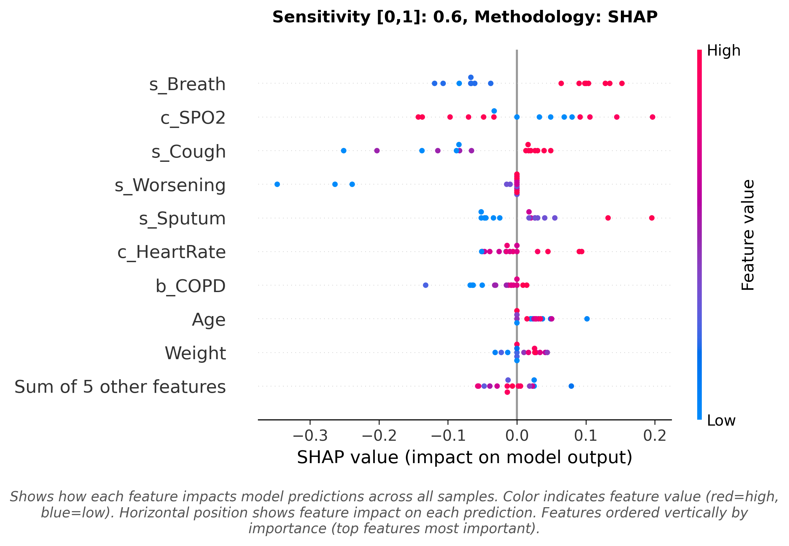
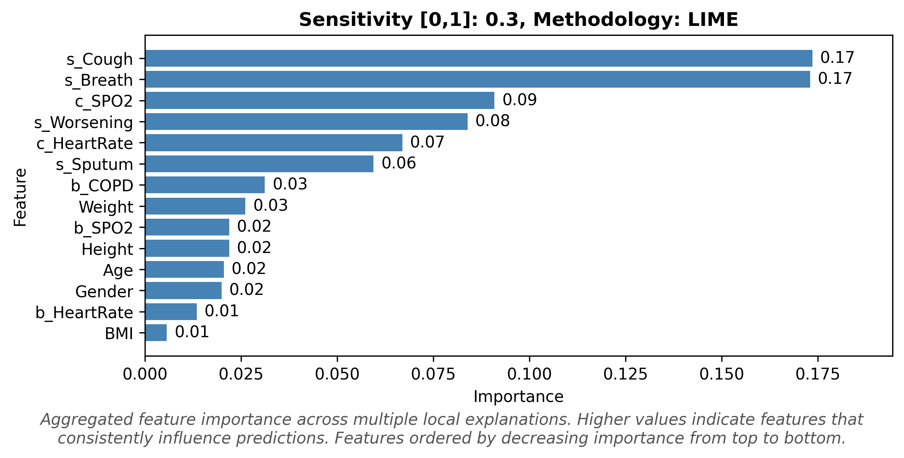
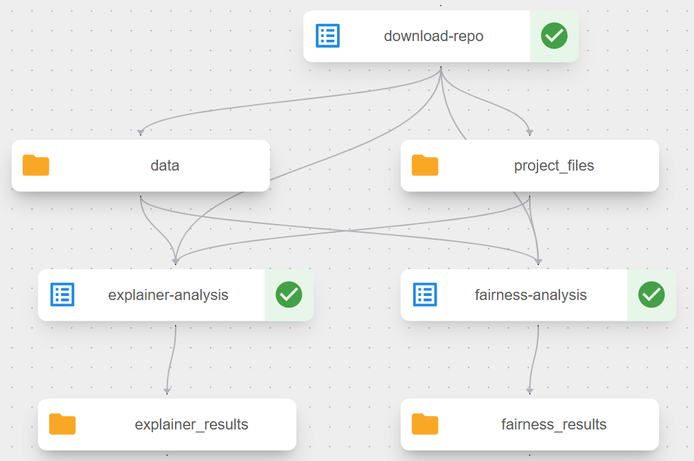
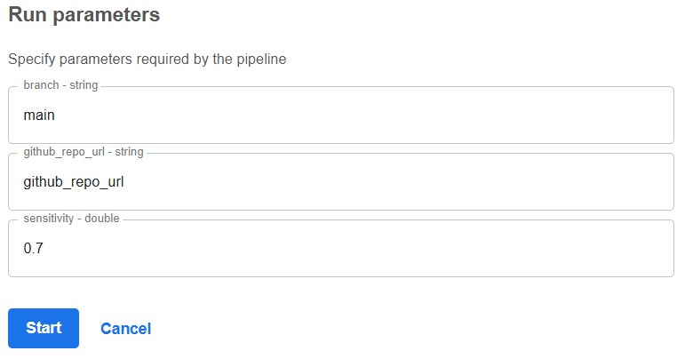

# realm_task_3_3_implementation_xai

## General Task Description

Components developed in Task 3.3 aim to implement agnostic XAI techniques on top of AI models that are used for various tasks such as classification or segmentation. We aim to implement two XAI techniques per Use Case - that would be selected dynamically from the Fuzzy system based on User's Input (sensitivity value coming from the RIANA dashboard), implement bias and fairness metrics (as agreed [here](https://maastrichtuniversity.sharepoint.com/:w:/r/sites/FSE-REALM/_layouts/15/Doc.aspx?sourcedoc=%7B9EDAE561-2787-42D1-BBB8-C9320C0B1F25%7D&file=Report%20on%20Bias%20and%20Fairness%20Metrics%20%5BTask%203.3%5D.docx&action=default&mobileredirect=true)) based on model outputs and extract outputs in a digestible manner (images, metrics, etc.).

This component, no matter the Use Case, expects as input:
- Sensitivity value (RIANA dashboard)
- Trained model (AI Orchestrator)
- Compatible dataset (AI Orchestrator)

This component, no matter the Use Case, returns as output:
- XAI methodology output (depending on the Use Case - image or json file)
- Fairness and Bias results (depending on the Use Case - json file or nothing if we are talking for images)


## COPD Triage Prediction with Explainability (Use Case 5)

This project provides tools for analyzing and interpreting the predictions made by the COPowereD model, which predicts the need for medical attention in COPD patients based on self-measured ambulatory parameters.  
It uses SHAP and LIME explainability methods to identify key features influencing the model's predictions.  
Additionally, it includes fairness/bias analysis to detect potential biases across demographic groups (Age and Gender).

## Project Overview

The COPowereD model takes clinical biomedical data and predicts whether a COPD patient needs medical attention. This project adds an explainability layer, allowing users to understand why the model makes certain predictions and assess potential biases.

**IMPORTANT**: The model is a Gradient Boosted Tree classifier trained on tabular clinical data. The explainability analysis uses model-agnostic techniques (SHAP for higher sensitivity (≥ 0.5), LIME for lower sensitivity (< 0.5)) to provide interpretable insights.

Key Components:
1. Input Data: CSV file containing clinical biomedical data for COPD patients with features including demographics, baseline vitals, and current symptoms. More details in the [Data Structure section](#data-structure) below.
2. Model: Dockerized Gradient Boosted Tree Pipeline (GBTP) for binary classification (`needMedicalAttention` vs `notNeedMedicalAttention`), wrapped by [COPowereD_model.py](./COPowereD_model.py). Model details available in the provided model card.
3. Fairness/Bias Analysis: Performed using the [fairness_bias_analysis.py](./fairness_bias_analysis.py) script. Evaluates equalized odds and demographic parity across Age and Gender groups (`age` and `sexe` columns). This script can be executed independently and as part of the Kubeflow pipeline component.
4. Explainability Analysis: Performed using the [explainer.py](./explainer.py) script with dynamic method selection based on sensitivity value. It uses the Dockerized model directly. Again, this script can be executed independently and as part of the Kubeflow pipeline component.
5. Visualizations: Generated using [fairness_bias_visualization.py](./fairness_bias_visualization.py) and [explainer_visualization.py](./explainer_visualization.py) scripts.


## Getting Started

### Prerequisites
- Python 3.14 is preferred. The Kubeflow components use `python:3.14-slim`.
- Required Python packages (installed via `pip install -r requirements.txt`, can be found in [requirements.txt](./requirements.txt))

### Data Structure

The input data is expected to be in CSV format with the following structure (features and label). The label column can take two values, 0 and 1 (label: 0 = No medical attention needed, 1 = Medical attention needed).

| sexe | age | baseline_height | baseline_weight | baseline_bmi | baseline_copd | baseline_heartRate | baseline_spo2 | symp_worsening | symp_breath | symp_cough | symp_sputum | heartRate | spo2 | label |
|------|-----|-----------------|-----------------|--------------|---------------|--------------------|---------------|----------------|-------------|------------|-------------|-----------|------|-------|
| 0    | 80  | 175.26          | 63.5            | 20.67        | 3             | 82                 | 91            | 2              | 3           | 2          | 0           | 92        | 89   | 1     |
| 0    | 54  | 154.94          | 53.98           | 22.49        | 0             | 81                 | 93            | 0              | 2           | 2          | 0           | 81        | 92   | 0     |

### Running the COPowereD Model

The current codebase runs the COPowereD model through the Dockerized wrapper in [COPowereD_model.py](./COPowereD_model.py). The wrapper uses the local Docker image `copd_comunicare:1.0.1` by default, or the image configured through the `COPOWERED_MODEL_IMAGE` environment variable.

The Docker model expects the feature columns shown above without the `label` column and writes `result.csv` with a single `proba` column containing the predicted probability of `needMedicalAttention`.

An example Docker `result.csv` is shown below:

```csv
proba
0.38523909005359264
0.28790749396075277
0.9798439176048229
```

For local script and Kubeflow execution, predictions are represented by this `proba` column.

### Analyses Execution

In order for the analyses to be executed:
- The provided dataset should be available as `data/data.csv` or another labeled CSV with the same columns.
- For an input CSV dataset, the explainability and fairness analyses can be executed as described in the next sections.

#### Fairness/Bias Analysis

The fairness and bias analysis can be executed independently using the following command:
```bash
python fairness_bias_analysis.py --tabular_data 'data/data.csv' --pred_target 'path/to/pred.csv' --output 'output/fairness_analysis.json'
```

Arguments:
- `--tabular_data`: Path to the input tabular data CSV file.
- `--pred_target`: Path to the model's predicted labels CSV file.
- `--output`: Path to save the output JSON file containing the fairness and bias metrics.

The predicted labels are expected to be in CSV format with the following structure. The label column can take two values, 0 and 1 (label: 0 = No medical attention needed, 1 = Medical attention needed).

| label |
|-------|
| 1     |
| 0     |

If starting from a Docker `result.csv` file, the `proba` values should be converted to binary predicted labels before running the script. The Kubeflow pipeline performs this conversion automatically with a `0.5` threshold.

Visualization of the results can be done using the `fairness_bias_visualization.py` script:

```bash
python fairness_bias_visualization.py --analysis_results 'output/fairness_analysis.json' --output output
```

Arguments:
- `--analysis_results`: Path to the JSON file containing the fairness and bias metrics.
- `--output`: Directory to save the generated visualizations. Default is `output`.

#### Explainability Analysis
The explainability analysis can be executed independently using the following command:

```bash
python explainer.py --tabular_data 'data/data.csv' --sensitivity 0.7 --output output
```

Arguments:
- `--tabular_data`: Path to the input tabular data CSV file.
- `--sensitivity`: Sensitivity value (between 0 and 1) to determine the explainability technique to be used. Default is `0.7`.
  - sensitivity < 0.5: LIME analysis
  - sensitivity ≥ 0.5: SHAP analysis
- `--output`: Directory to save the output files (explanations). Default is `output`.

Visualization of the results can be done with the `explainer_visualization.py` script:
```bash
python explainer_visualization.py --analysis_results path/to/output/shap_detailed_results.pickle --output output --sensitivity 0.5
```

Arguments:
- `--analysis_results`: Path to the analysis results file (`pickle` for SHAP, `json` for LIME).
- `--output`: Directory to save the generated visualizations. Default is `output`.
- `--sensitivity`: Sensitivity value (between 0 and 1) indicating the explainability technique used. Default is `0.7`.
  - sensitivity < 0.5: LIME analysis
  - sensitivity ≥ 0.5: SHAP analysis

Alternatively, the analyses and visualizations can be executed as part of the Kubeflow pipeline component, as described in the [Kubeflow Pipeline Component](#kubeflow-pipeline-component) section below.


## JSON Output

### Fairness and Bias Analysis Output
The fairness and bias analysis outputs a JSON file, `fairness_analysis.json`, with the following structure. The metrics are calculated based on two demographic attributes, age and gender (`age` and `sexe` columns).

```json
{
    "equalized_odds_metrics": {
        "age": {
            "error_rates_by_group": {
                "70+": {
                    "false_positive_rate": 0.0
                },
                "55-69": {
                    "false_positive_rate": 0.5
                },
                "40-54": {
                    "false_positive_rate": 0.25
                }
            }
        },
        "sexe": {
            "error_rates_by_group": {
                "0": {
                    "false_positive_rate": 0.0
                },
                "1": {
                    "false_positive_rate": 0.4
                }
            }
        }
    },
    "demographic_parity_metrics": {
        "age": {
            "prediction_rates_by_group": {
                "70+": 0.4444444444444444,
                "55-69": 0.2,
                "40-54": 0.3333333333333333
            }
        },
        "sexe": {
            "prediction_rates_by_group": {
                "0": 0.2727272727272727,
                "1": 0.4444444444444444
            }
        }
    }
}
```

### Explainability Analysis Output
The explainability analysis outputs can either refer to SHAP analysis or LIME explanations, depending on the sensitivity value provided as input.

#### SHAP Analysis Output (sensitivity ≥ 0.5)
SHAP analysis produces two files:
- `shap_analysis.json`: Global feature importance metrics
- `shap_detailed_results.pickle`: Complete SHAP values for all instances

`shap_analysis.json` structure:
```json
{
    "feature_importance": [
        0.2055,
        0.1406,
        0.0309,
        ...
    ],
    "shap_direction_mean": [
        0.1105,
        0.0906,
        -0.0309,
        ...
    ],
    "shap_std": [
        0.0105,
        0.0089,
        0.0047,
        ...
    ],
    "shap_values": [
        [0.2211, 0.1495, -0.0355, ...],
        [0.1, 0.0318, -0.0262, ...],
        ...
    ],
    "features": [
        "sexe",
        "age",
        "baseline_heartRate",
        ...
    ]
}
```

The `shap_detailed_results.pickle` contains the complete SHAP values object for all instances, exactly as extracted from the SHAP analysis process.

#### LIME Analysis Output (sensitivity < 0.5)
LIME analysis produces two files:
- `lime_analysis.json`: Global feature importance aggregated from local explanations
- `lime_detailed_results.json`: Per-instance feature weights

`lime_analysis.json` structure:
```json
{
    "spo2": {
        "importance": 0.2231,
        "mean_weight": 0.1113,
        "std_weight": 0.0431
    },
    "symp_sputum": {
        "importance": 0.1554,
        "mean_weight": 0.0916,
        "std_weight": 0.0554
    },
    "age": {
        "importance": 0.0209,
        "mean_weight": 0.0189,
        "std_weight": 0.0201
    },
    ...
}
```

`lime_detailed_results.json` structure (sample):
```json
[
    {
        "instance_idx": 0,
        "true_class": 1,
        "predicted_class": 1,
        "explained_class": 1,
        "spo2": 0.1244,
        "symp_sputum": -0.0538,
        "age": 0.0210,
        "baseline_height": -0.0129,
        ...
    },
    {
        "instance_idx": 1,
        "true_class": 1,
        "predicted_class": 1,
        "explained_class": 1,
        "spo2": -0.1218,
        "symp_sputum": 0.0570,
        ...
    }
]
```

## Visualizations Output

### Fairness and Bias Analysis Visualizations

Equalized Odds and Demographic Parity Plots for Age Demographic column:


Equalized Odds and Demographic Parity Plots for Gender (`sexe`) Demographic column:


### Explainability Analysis Visualizations
SHAP and LIME Explanations Plots
<p align="center">
  
  
  
</p>

## Understanding the Results

### Fairness and Bias Analysis Output
The fairness analysis produces:
- Equalized Odds Metrics: Measures whether error rates are similar across demographic groups.
- Demographic Parity Metrics: Ensures prediction rates are similar across demographic groups.
- Visualizations: Bar Charts visualizing the above results.

### Explainability Analysis Output
For SHAP:
- Global feature importance identifies which features most influence model predictions overall (averaged across all instances).
- `feature_importance`: Higher values = stronger average impact on predictions.
- `shap_direction_mean`: Indicates whether feature generally increases (positive) or decreases (negative) the probability of needing medical attention.
- `shap_std`: Indicates consistency - lower values mean the feature has similar impact across instances.
- `shap_values`: Instance-level SHAP values (rows = instances, columns = features).
- The Bar Plot shows global feature importance (mean absolute SHAP value). Higher bars indicate features with stronger average impact on predictions.
- `Beeswarm Plot`: Shows the distribution of SHAP values for each feature across all instances. Each dot represents one instance, colored by feature value (high=red, low=blue). Position indicates the SHAP value (impact on prediction).

For LIME:
- Global importance is derived from averaging local explanations across all instances.
- `importance`: Mean absolute weight indicates average magnitude of influence.
- `mean_weight`: Indicates average direction (positive/negative).
- `std_weight`: Indicates variability - higher values mean the feature's importance varies more across instances.
- Detailed results show which features were most important for each individual prediction, allowing for instance-level interpretation.
- The Bar Plot shows aggregated global feature importance from LIME local explanations. Features are ranked by their average absolute weight across all instances.


## Kubeflow Pipeline Component

The [copowered_pipeline_component.py](./kubeflow_component/copowered_pipeline_component.py) file defines a Kubeflow pipeline for automating the COPowereD XAI analysis workflow. This pipeline orchestrates the following components:

Before compiling the pipeline for deployment, set the `DOCKER_IMAGE` constant in [copowered_pipeline_component.py](./kubeflow_component/copowered_pipeline_component.py) to the COPowereD image that Kubeflow can pull.

- Download Component: Downloads project files and data from a specified GitHub repository and branch. The pipeline expects the repo to contain:
  - Project files in root: `COPowereD_model.py`, `explainer.py`, `fairness_bias_analysis.py`, `fairness_bias_visualization.py`, `explainer_visualization.py`, `utils.py`.
  - Data in `data/` folder: `data.csv` (with labels).
- COPowereD Predictions: Removes the `label` column, runs the configured COPowereD Docker image, and writes `result.csv` with a `proba` column.
- Fairness/Bias Analysis: Converts the Docker `proba` values to predicted labels with a `0.5` threshold and executes the fairness and bias analysis using the provided script, generating the output mentioned in the [Fairness and Bias Analysis Output](#fairness-and-bias-analysis-output) section.
- Fairness/Bias Visualization: Creates visual representations of fairness / bias metrics across demographic groups (Age, Gender; `age` and `sexe` columns), generating consolidated bar charts showing equalized odds (false positive rates) and demographic parity (prediction rates). Outputs PNG files described in [Fairness and Bias Analysis Visualizations](#fairness-and-bias-analysis-visualizations).
- Explainability Analysis: Executes the explainability analysis using the provided script and generates the output mentioned in the [Explainability Analysis Output](#explainability-analysis-output) section.
- Explainability Visualization: Generates visualizations based on the selected method (determined by sensitivity parameter):
  - SHAP (sensitivity ≥ 0.5): Beeswarm and bar plots showing feature impacts.
  - LIME (sensitivity < 0.5): Bar plot showing aggregated feature importance.
  - Outputs PNG files described in [Explainability Analysis Visualizations](#explainability-analysis-visualizations).

### Pipeline Architecture
The pipeline follows this execution pattern:
- Sequential Phase: Repository download runs first.
- Prediction Phase: Dockerized COPowereD predictions run after repository download completes.
- Fairness-Bias Phase: Fairness-Bias analysis runs after model predictions complete.
- Explainability Phase: Explainability analysis runs after repository download complete.
- Visualization Phase: Each analysis step is followed by its corresponding visualization step:
  - Fairness analysis followed by Fairness visualization
  - Explainability analysis followed by Explainability visualization



### Running the Pipeline
The pipeline can be compiled for deployment to a Kubeflow environment by executing:
```bash
python kubeflow_component/copowered_pipeline_component.py
```

The execution will generate a YAML file, `copowered_pipeline.yaml`, which can be used to create a new pipeline in Kubeflow by uploading the file through the Kubeflow UI.

The Kubeflow UI expects the following pipeline run parameters (arguments) when running:
- `github_repo_url`: URL of the GitHub repository containing the project files and data.
- `branch`: The branch of the GitHub repository to use. Default is `main`.
- `sensitivity`: Sensitivity value (between 0 and 1) to determine the explainability technique to be used. Default is `0.7`.




### Accessing the Generated Artifacts

The pipeline stores generated artifacts in MinIO object storage within the Kubeflow namespace. To access these artifacts:

- Set up port forwarding to the MinIO service by running `kubectl port-forward -n kubeflow svc/minio-service 9000:9000` in a terminal window
- Access the MinIO web interface at http://localhost:9000
- Log in with the default credentials: username: `minio`, password: `minio123`
- Navigate to the mlpipeline bucket, where you'll find the generated folders and files from each pipeline step, according to the automatically assigned uuid of the pipeline. (An example location could be: `http://localhost:9000/minio/mlpipeline/v2/artifacts/copowered-model-fairness-bias-and-explainer-pipeline/6d0fec69-aff6-487d-b717-71d45e25c71f/`)


## 📜 License & Usage

All rights reserved by MetaMinds Innovations.
